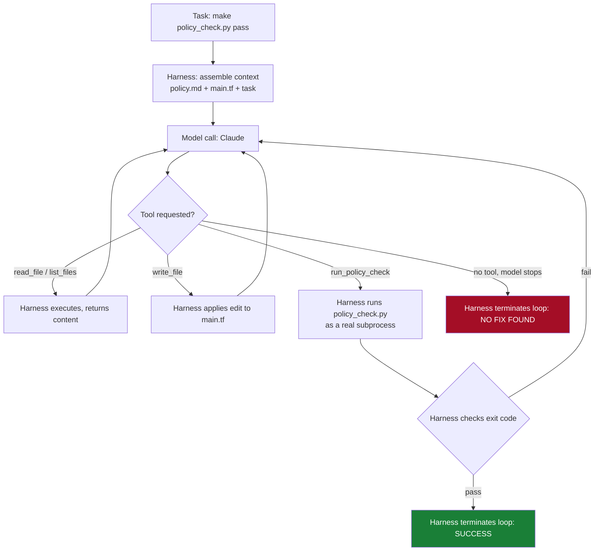

# devops-agent-harness

A minimal, working agent harness that solves a real DevOps problem end-to-end:
**an S3 bucket Terraform config that fails a compliance guardrail scan, fixed
autonomously by an agent that reads the failure, edits the code, and re-runs
the check until it genuinely passes.**

This repo exists to make the "agent harness" concept concrete. It is not a
toy chatbot demo — `policy_check.py` is a real, independent CI gate. The
agent does not get to grade its own homework; the harness re-runs the exact
tool a pipeline would run and only stops when that tool says pass.

---

## 1. The problem

`example_problem/main.tf` provisions an S3 bucket used to stage AWS MGN/DMS
migration artifacts. Your org's compliance guardrail (`example_problem/policy.md`)
requires every such bucket to have:

1. Server-side encryption enabled
2. Versioning enabled
3. A public access block with all four settings `true`
4. Required tags: `Environment`, `Owner`, `CostCenter`, `DataClassification`

`main.tf` as committed violates **all four**. `policy_check.py` is the same
kind of guardrail scanner you'd run in CI (`.github/workflows/policy-check.yml`
wires it up as a PR gate). Right now, that pipeline is red.

Run it yourself:

```bash
python3 policy_check.py example_problem/main.tf
```

```
❌ FAIL: 4 violation(s) found
  - S3 bucket 'migration_artifacts' has no server-side encryption configuration
  - S3 bucket 'migration_artifacts' has no versioning configuration
  - S3 bucket 'migration_artifacts' has no public access block resource
  - Missing required tag(s) on 'migration_artifacts': Environment, Owner, CostCenter, DataClassification
```

## 2. The task

```bash
export ANTHROPIC_API_KEY=sk-ant-...
pip install -r requirements.txt
python3 run_agent.py
```

`run_agent.py` gives the harness one instruction: *"Fix `example_problem/main.tf`
so it passes `policy_check.py`, without gutting the resource to cheat the
check (e.g. don't just delete the bucket)."* It then loops — read, edit,
re-run the check, repeat — until the scanner returns a real pass or a turn
budget is exhausted.

## 3. Architecture



The critical detail: **the harness decides success, not the model.** Success
is `policy_check.py` exiting 0 — a fact the harness observes independently,
not a claim the model makes about its own work.

## 4. Repo layout

```
devops-agent-harness/
├── README.md
├── requirements.txt
├── run_agent.py                  # entrypoint
├── policy_check.py               # independent compliance gate (the "ground truth")
├── harness/
│   ├── agent.py                  # the agentic loop itself
│   ├── tools.py                  # tool schemas + sandboxed implementations
│   └── config.py                 # system prompt, model, turn/command limits
├── example_problem/
│   ├── main.tf                   # broken Terraform (what the agent fixes)
│   └── policy.md                 # human-readable guardrail doc, given to the agent as context
└── .github/workflows/policy-check.yml   # the same gate, wired into CI
```

## 5. How this differs from other AI usage methods

See [`comparison.md`](./comparison.md) for the full breakdown. Short version:
copy-pasting Terraform out of a chat window gets you code that *looks*
compliant. This harness gets you code that has been **proven** compliant by
the same tool your pipeline trusts, with every edit and every check run
logged — because the harness, not the model, holds the definition of "done."
